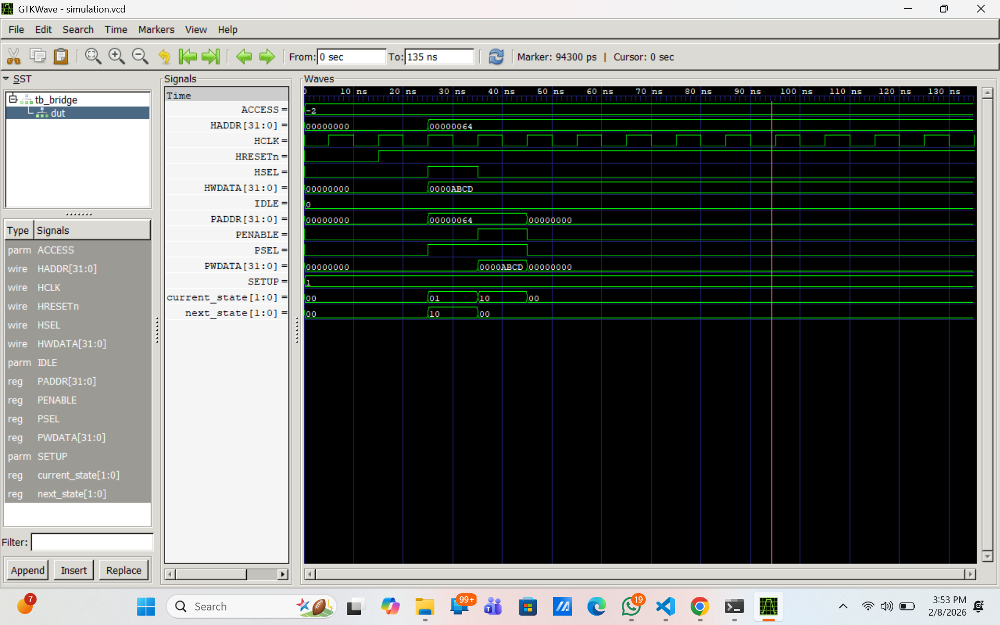
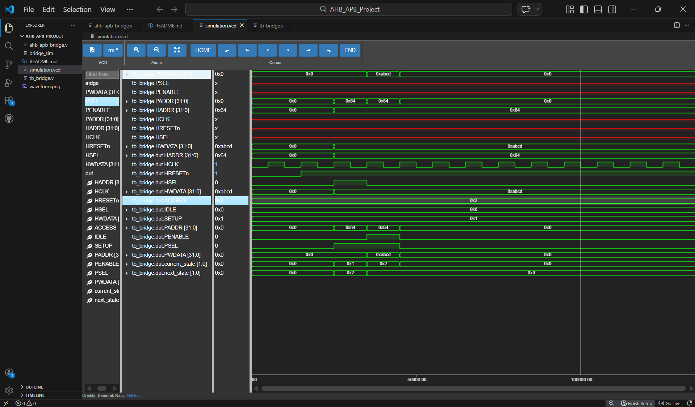

# AMBA AHB-to-APB Bridge RTL Design (Icarus Verilog)

This project implements a digital AHB-to-APB Bridge from RTL to functional verification. 
It serves as a communication interface between a high-performance AHB-Lite bus and low-power APB3 peripherals, handling the protocol conversion and timing requirements.

## 📌 Project Overview

* **Design Level**: RTL (Register Transfer Level)
* **Protocol**: AMBA AHB-Lite to APB3
* **FSM States**: IDLE, SETUP, ACCESS
* **Verification**: Functional Simulation with timing analysis

## 🛠️ Technologies & Tools Used

* **Verilog HDL**: Hardware Description Language for core logic
* **Icarus Verilog**: Open-source compiler and simulator
* **GTKWave**: Waveform visualization and timing analysis
* **VS Code**: Primary code editor

## 📂 Project Files

* `ahb_apb_bridge.v`: Main RTL source code for the bridge logic
* `tb_bridge.v`: Testbench file for verifying protocol timing
* `simulation.vcd`: Generated value change dump file for waveforms
* `waveform.png`: Final output screenshot of the signal transitions

## ▶️ How to Run Simulation

1. Compile the design and testbench:
   `iverilog -o bridge_sim ahb_apb_bridge.v tb_bridge.v`
2. Run the automated simulation:
   `vvp bridge_sim`
3. View the timing diagrams:
   `gtkwave simulation.vcd`

## 📤 Output

* **Protocol Conversion**: Successfully converts AHB Master signals into synchronized APB PSEL and PENABLE signals.
* **Verification**: The testbench verifies single-write transfers with correct clock cycle delays.
* **Status**: Functional verification complete with 0 timing violations.

## 🖼️ Output Example

*Figure 1: Timing diagram showing HCLK, HSEL, PSEL, and PENABLE transitions in gtkwave simulation.*

*Figure 2: Timing diagram showing HCLK, HSEL, PSEL, and PENABLE transitions in VS Code.*

## 👤 Author

**Name**: Kartik Murti

**Project Type**: Digital Logic Design / VLSI Verification

